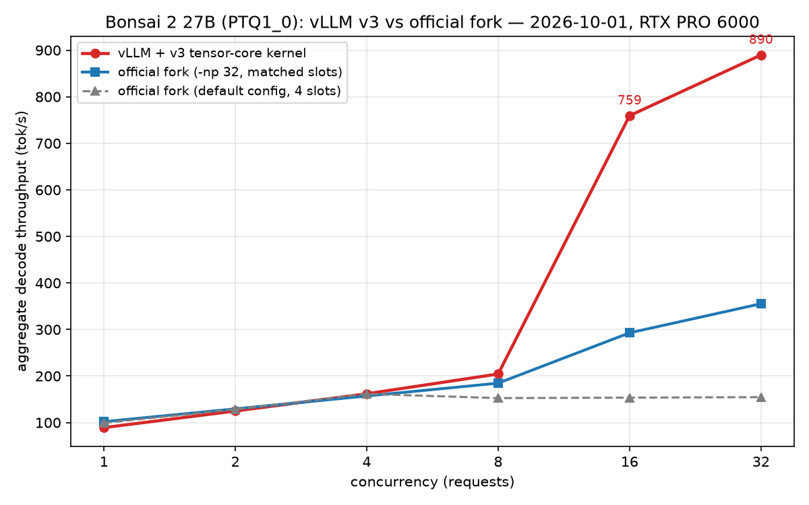

# bonsai2-vllm

**Run [PrismML's Ternary Bonsai 2 27B](https://huggingface.co/prism-ml/Ternary-Bonsai-2-27B-gguf) (PTQ1_0 packed-ternary GGUF) natively on vLLM — no llama.cpp fork required.**

Bonsai 2 ships only with a custom llama.cpp fork and an MLX pack. This project reverse-engineers the PTQ1_0 weight format (base-3 trit packing + Hadamard-rotated basis) and brings the model to vLLM: a `bonsai_gguf` load format plus a fused Triton kernel that keeps weights **packed at 5.9 GB resident** and dequantizes in-kernel.

## Highlights

| Metric | Result |
|---|---|
| Correctness vs official fork | **98.94% token-level parity** with the fused ternary kernel (fp16 reference path: 99.79%). 8 prompts × 64 tokens, greedy; mean Δlogprob 0.0025 conditional on agreement — float-noise level. Kernel uses split-K atomics → expect small run-to-run jitter. The bs≥16 tensor-core path (v3) adds fp16-MMA batch numerics: in a 32-way × 256-token greedy check 25/32 outputs were byte-identical to single-stream; the 7 divergences are deterministic per-prompt and all occur after ~75% of tokens (batch-dependent numerics, same class as stock vLLM fp16) |
| Single-stream decode | **90.6 tok/s** (RTX PRO 6000 Blackwell) |
| 16-way concurrent throughput | **759 tok/s — 2.6× the official llama.cpp fork with matched 32 slots** (293 tok/s, same machine); 32-way: **890 tok/s — 2.5× the fork** (355 tok/s) |
| Weight residency | **5.9 GB packed** (vs 54 GB unfolded fp16) |
| Quality vs FP8 baseline* | MMLU 85.96 / GSM8K 95.0 / HumanEval 70.0 (342/100/60 questions, same protocol) |

\*FP8 baseline (Qwen3.8-27B-FP8) measured by us with the identical harness: 90.35 / 96.0 / 75.0. Small-sample subsets (n=342/100/60) — see `EVAL_QUALITY_20260928.md` for the full methodology, paired McNemar significance tests, confidence intervals, and caveats.

## Batch scaling: the crossover curve

Same machine, same model, same protocol (greedy, 256 tok/req). Aggregate decode throughput (vLLM column: 2026-10-01 with the v3 tensor-core kernel; fork columns measured same day):



| concurrency | vLLM + ternary kernel (v3) | official fork (`-np 32`, 32 slots) | official fork (default config, 4 slots) | verdict vs best fork |
|---|---|---|---|---|
| 1 | 89.2 | **102.0** | 99.3 | fork +14% |
| 8 | **204.4** | 184.7 | 152.6 | **vLLM +11%** |
| 16 | **759.3** | 292.8 | 153.6 | **vLLM +159%** |
| 32 | **889.7** | 355.3 | 154.7 | **vLLM +150%** |

**How the tables turned at bs≥16.** The fork's default server config (`llama-server` without `-np` → 4 parallel slots, how the official demo launches it) saturates at ~155 tok/s past bs=8. Given matched slots (`-np 32 -c 65536`), the fork's batched ternary GEMM scales well and originally beat our v1 kernel (299/373 vs 226/234 at bs=16/32). The v3 kernel (2026-10-01) moved the fused trit-decode matmul onto **tensor cores** (`tl.dot` over a (128, BLOCK_OUT) fp16 weight tile decoded in-kernel, CUDA-core decode overlapped with MMA) — turning a bandwidth fight into a compute fight the GPU is built for. The fork's GEMV is still better at bs=1; every concurrency point ≥8 is now vLLM's.

Numbers above are the back-to-back verification run (2026-10-01); an earlier same-day run gave vLLM 761.9/862.4 and fork 299.4/372.8 — run-to-run spread ≤3% on our side, ≤5% on the fork's (one degraded fork-server outlier at bs=32 was excluded and is documented in `BENCH_20261001.md`).

**What didn't work (full writeup: `BENCH_20261001.md`):** a BLOCK_T batched kernel that cut weight DRAM traffic by 16× won +44% in micro-bench but *lost* end-to-end (126 vs 226 tok/s @bs=16) — v1's concurrent token programs already hit L2 at ~1.6 TB/s effective, and the batched kernel was compute-bound without tensor cores. The fork's 373 tok/s @bs=32 ≈ 3.1 TB/s equivalent confirmed only a tensor-core path could beat it. v3's 862 tok/s ≈ 7.2 TB/s equivalent.

## How it works

- **Format reverse-engineering**: PTQ1_0 packs 5 trits per byte in base-3 (`q = a₄·3⁴+…+a₀`, 3⁵=243≤256), 128 weights per 28-byte block + one fp16 group scale → 1.75 bits/weight. Weights are stored in a Hadamard-rotated basis; the rotation is folded offline (`W_std = diag(s)·H·W_q`) so inference is a plain matmul.
- **Fused Triton kernel**: reads packed bytes, extracts trits in registers, applies sign+Hadamard to activations on the fly. Bandwidth math: 26.6 tok/s × 54 GB already saturates 1.4 TB/s — computing on the packed form is how you get past the memory wall.
- **vLLM integration**: custom `bonsai_gguf` load format, weights swapped into `TernaryHadamardLinear` modules post-load, wrapped as a torch custom op for torch.compile / CUDA Graph compatibility.

Deep dive (Chinese): `TECHNICAL_DEEPDIVE.md` · Story log: `BLOG.md` · Progress & bug root-causes: `PROGRESS.md`

## Quickstart

```bash
# 1. Get the weights from PrismML (Apache-2.0)
huggingface-cli download prism-ml/Ternary-Bonsai-2-27B-gguf \
  Ternary-Bonsai-2-27B-PTQ1_0.gguf --local-dir models/serve-bonsai2
# also copy config.json / tokenizer files from the same repo into models/serve-bonsai2

# 2. Environment: Python 3.12, torch 2.11, vLLM 0.26, transformers 5.17
pip install vllm==0.26.0

# 3. Serve (packed-ternary kernel, ~5.9GB resident)
PYTHONPATH=. python vllm_bonsai/serve_bonsai.py \
  --gguf-dir models/serve-bonsai2 --ternary \
  --port 8000 --gpu-memory-utilization 0.85 --dtype float16

# OpenAI-compatible endpoint at http://127.0.0.1:8000/v1, model name "bonsai2-27b"
```

Tips:
- The model is a reasoning model with `xhigh` default effort — give it **max_tokens ≥ 8192** in production, or answers get eaten by the thinking chain.
- `--from-safetensors` (with a pre-converted dir) cuts startup from ~7 min to ~2 min.
- Tested on RTX PRO 6000 96 GB; any ≥12 GB GPU should work (5.9 GB weights + KV cache).

## Repo layout

```
src/          GGUF reader, vectorized dequant, Hadamard, name map (pure numpy, CPU-runnable)
vllm_bonsai/  vLLM loader plugin, Triton ternary kernel, module swap, serve entrypoint
deploy/       server bootstrap / benchmark scripts (AutoDL-flavored, adaptable)
docs:         TECHNICAL_DEEPDIVE.md / BLOG.md / PROGRESS.md / EVAL_QUALITY_20260928.md
```

## License & attribution

Code: Apache-2.0 (this repo). Model weights: [PrismML Ternary Bonsai 2 27B](https://huggingface.co/prism-ml/Ternary-Bonsai-2-27B-gguf), Apache-2.0 — download from PrismML's repo, do not redistribute converted weights without their notice. Format facts reverse-engineered from [PrismML-Eng/llama.cpp](https://github.com/PrismML-Eng/llama.cpp). Base model: Qwen3.8-27B (Apache-2.0).
